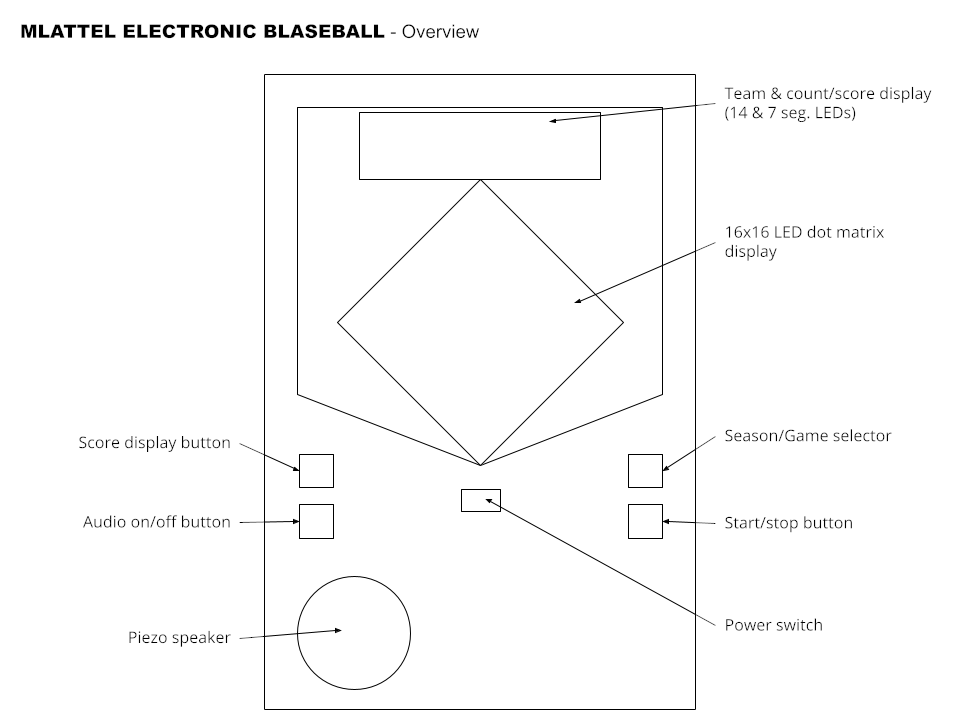

# Mlattel Electronic Blaseball

Relive the early days of handheld gaming with Mlattel Electronic Blaseball,
the portable blaseball game that's fun for the whole family!

An entry in the [2021 SIBR Hackathon](https://cursed.sibr.dev). This time, it's
cursed in real life!

## About the Project and Current State (as of submission)

Boy did I dream big with this one.

In general, this was an attempt to mimic the [1978 handheld electronic baseball
game](https://www.handheldmuseum.com/Mattel/BaseB.htm) from Mattel, but as a
blaseball game viewer. Because this would require hardware work, I had to order
parts and assemble (or even disassemble &mdash; but that's a story for the blog)
them, as well as design and 3D print an enclosure. Thus a lot of the work on
this project could only be done toward the end of the hackathon, and that turned
out to be a major limiting factor preventing a more complete submission.

Luckily, by working on [Sloviet Blaseball](https://github.com/malorisdea/SlovietBlaseball)
in the meantime, I was able to iron out a lot of the initial difficulties in
getting a game feed in the format I wanted. I largely copied that code to this
repo with some small modifications (see the `mlattel/blaseball` directory).
This allowed me to get up and running relatively quickly once the various LED
bits and bobs arrived.

Overall, the vision was to produce a self-contained, handheld device that would
allow the user to select any blaseball game from (recorded) history and watch it
play out in monochromatic LED glory. This is, I think, still possible, but
in the current prototype as submitted there are several caveats.

- Even though I was eventually able to compile [vcr](https://github.com/alisww/blaseball.vcr/)
  for ARM (which took roughly 50 minutes to compile on a Raspberry Pi 4... :oof:)
  the server takes approximately 38 seconds to load game event data off of a
  Samsung EVO class 10 MicroSD with an overclocked storage driver. This is not
  an ideal startup time. Nobody wants to listen to a shitty speaker playing
  "Take Me Out to the Ballgame" for that long. Thus, the device needs to access
  the Datablase over the internet.
- Due to quirks in the Python `keyboard` module and how it works on Linux, I
  wasted a lot of time on the non-hardware test version and ultimately was not
  able to get a working version with a season/game selection interface. The
  prototype currently operates with a hardcoded game ID.
  - For the same reason, the console-only test version does not include a terminal
    graphics playing field, which would've been cool to do. It just prints out
    the game updates, boringly.
- Currently the device is powered by a full-size Raspberry Pi 3 Model B+, which
  is a huge waste of space. Ideally the final version would use a Pi Zero.
- The pushbuttons I bought are really clicky, which is not what I wanted.
- Due to the limited amount of space on my 3D printer, I had to eliminate all
  but one row of LED alphanumeric displays at the top. On the one hand, this
  is more accurate to the original; on the other, displaying team and player
  names on 7-segment LEDs is not great!
- Using a piezo buzzer lends the project a really charming air of authenticity,
  but the GPIO pin I have it on now is picking up a _huge_ amount of noise from
  the PWM clock being used to drive the LED matrix display.
- Due to time and material availability I was not able to make a playing field
  screen. The interface is pretty confusing without it.
- I did not have time to design and print the actual faceplate, and so the
  prototype has this dog-ugly rapid print instead (I even went and found the
  original font Mattel used...)
- The device is currently not battery powered, and is thus not portable at all.

All of these are, I think, easy to overcome, and I plan to continue to improve
the outward appearance of the device in the hopes of being featured on the SIBR
hackathon page.

### The Curse, or A Brief Summary of What Went Wrong

Like so many baseball and blaseball players before me, my hubris attracted the
attention of the gods, who managed to snarl the project in a really interesting
number of ways. I am not particularly superstitious, but I am now convinced
that this project is, indeed, cursed &mdash; and not in the way that I intended
as an entrant in the "cursed viewer" hackathon.

Some of the things that went wrong include: every shipment of parts was delayed
for various reasons; one in particular was delayed due to a mechanical failure
on a UPS truck, which is a shipping status update I've never seen before; the
browser tab containing my faceplate design crashed, losing significant progress;
despite multiple precautions the project has been involved in several drops,
falls, and spills, far more than any other project I've done; the Raspberry Pi
itself seems to have come down with several issues that it has not had before,
including not being able to find SPI devices at all, which are mysteriously
resolved with a reboot or three; and the LED matrix display is apparently just
nondeterministic in behavior, as it may or may not flip block orientations or
even might not work at all sometimes (may be related to the Pi SPI issues as
these sometimes get resolved with a reboot).

Despite all this, the project was in a presentable state just minutes before
the deadline, so hopefully by submitting despite all the odds I have broken this
strange slump. We'll see what happens when I try to boot the thing up again.

## Layout and Operation



The prototype as submitted achieves (I believe) a decent subset of the features
intended for the full version. With some allowances for updating code manually,
the prototype functions well enough currently to follow a typical blaseball game
play-by-play.

Due to some of the restrictions encountered, the device is now laid out almost
identically to the original 1978 Mattel game. However, there are differences.

At the top of the device is a series of numeric LED displays. These serve
multiple purposes throughout a game:

- When a game begins, when an inning changes, or when a player steps up to bat,
  the team, pitcher, or player name is displayed.
  - At the start of a game, the left four characters are used to display the
    away team, and the right are used to display the home team.
    - Note: this is currently not working for an unknown reason
  - Also at the start, the away pitcher's name and home pitcher's name are
    both scrolled across the display.
  - Subsequently, whenever player or team names are displayed, they are
    scrolled across the display if they do not fit.
- Before the first pitch, the phrase "play ball" is displayed.
- During the course of play, the current inning is displayed at the far left,
  with the number alone being displayed for the top of the inning and the
  dot (".") illuminated at the lower right indicating the bottom of the inning.
  Then, to the right of the inning, the counts are displayed in order: outs,
  balls, and strikes.
- At the end of every inning or after a play that scores any number of runs,
  the left four characters are used to display the away team's score, and the
  right four are used to display the home team's score.
  - The Score button can be pressed at any time to show the score this way.

Below this is a 16x16 matrix of LEDs rotated 45&deg;, representing the field of
play. Ideally this would have a translucent grey plastic overlay decorated to
resemble a baseball diamond superimposed, [like the original](<https://commons.wikimedia.org/wiki/File:Mattel_Baseball,_Model_2942-0320,_Made_in_Hong_Kong,_Copyright_1978_(LED_Handheld_Electronic_Game).jpg>).
Currently this is absent.

The matrix animates and updates as the game progresses, representing the state
of play at a given moment.

- Each pitch is represented by an animation moving down toward "home plate."
- Each baserunner is displayed by a constantly illuminated dot on each "base."
- Strikes move past the location of "home plate" to be caught by the catcher.
- Balls move to the right of "home plate" to be outside the strike zone.
- Contact with the ball is represented by illuminating "home plate." Currently,
  fixed points are illuminated representing the outcome of the contact:
  - Foul balls are off to the right of "first base."
  - Ground outs are caught by the shortstop
  - Fly outs are caught by the center fielder
  - Hits go to short right field
  - Home runs go to the very top of center field.

There is also a small piezo speaker that provides audio during the game. As
noted, when a game starts a short melody is played. There are also audio cues
for many common game events:

- When a game starts, the first few bars of "Take Me Out to the Ballgame" are
  played
- Balls and strikes
- Hits, flyouts, and groundouts
- A short melody for home runs
- Half-inning and end-of-inning changes
- And the final few bars of "Take Me Out to the Ballgame" are played when the
  game is over or stopped

Audio can be muted at any point by pressing the Sound button. It can be turned
on again by pressing the same button. There is currently no volume control.

The Start button is used to start and stop the current game play-by-play. The
Selector button does nothing. Because the device is not yet battery powered,
the power switch is not included.

Currently, the device is started by powering on the Raspberry Pi and SSHing in
to start up the Mlattel application. Once this is done, the Start button can be
pressed to begin displaying game updates.

[Here is a short video demonstrating the prototype in operation](https://i.imgur.com/DpotGx8.mp4).

## Installation and Setup

To get this project running, you'll need to do a few things:

1. Don't.

This is a very important step. You may be inviting the curse upon yourself if
you proceed!

### Seriously Though

As submitted, the project takes a bit of leg work to get up and running. Due to
the dependency on [blaseball-mike](https://github.com/jmaliksi/blaseball-mike),
the project requires **Python version 3.8 or newer**. Because I didn't bake my
pip requirements, you'll need to install `blaseball-mike` yourself:

```sh
pip install blaseball-mike
```

### The Console Version

In order to get the console version up and running (I don't know why you would,
though, except to prove that the code works I guess?) you'll need to modify the
`mlattel/main.py` file to remove Raspberry Pi-specific code. And because I
never got around to fixing up the console version, you'll also have to create
a dummy audio output class. Basically, make the `main.py` file look like this:

```python
from mlattel.audio import Audio
from mlattel.display.console import ConsoleDisplay
from mlattel.app import App
from mlattel.input.keyboard import KeyboardInput

class DummyAudio(Audio):
    def startup(self):
        pass
    def shutdown(self):
        pass
    def handle(self, event: GameEvent):
        pass

def main():
    try:
        input = KeyboardInput()
        display = ConsoleDisplay()
        audio = DummyAudio()
        app = App(input, display, audio)
        app.run()
    except KeyboardInterrupt:
        app.stop()
        input.cleanup()
```

You should now be able to run the app:

```sh
python mlattel.py
```

Press the spacebar to begin the game.

### The Raspberry Pi Version

If you're feeling ambitious, and you happen to have the right hardware laying
around, you can run the Raspberry Pi version; it is the more complete version
and the more entertaining.

1.  First, you'll need to enable the SPI kernel module and enable the second
    SPI port overlay.

    To enable the SPI port overlay, add the following line to `/boot/config.txt`:

    ```ini
    dtoverlay=spi1-1cs
    ```

    You can enable the SPI module by adding the following line as well:

    ```ini
    dtparam=spi=on
    ```

    Or you can use the `raspi-config` command to do this graphically.

2.  Make sure your user account is in both the `gpio` and `spi` groups:
    ```sh
    sudo usermod -aG gpio,spi [username]
    ```
3.  Because the LED multiplexer library depends on Pillow, you'll need to grab
    a few prerequisites for that to work:
    ```sh
    sudo apt install build-essential python3-dev python3-pip libfreetype6-dev libjpeg-dev libopenjp2-7 libtiff5
    ```
4.  Again, since requirements are not baked, you will need to install the Python
    dependencies manually:
    ```sh
    pip install blaseball-mike luma.led_matrix
    ```

Now, go ahead and get your hardware ready. You'll want:

1.  An 8-digit seven-segment LED display or similar, driven by a single MAX7219
    multiplexer chip.
2.  Four 8x8 LED matrix modules, driven by one MAX7219 multiplexer **each**.
3.  Four normally-open SPST momentary pushbuttons
4.  One piezo buzzer

The numeric LEDs should be connected to the SPI port 0 pins. The LED matrices
should be daisy-chained and connected to the SPI port 1 pins. Why are they on
separate ports instead of all daisy-chained together? Because originally I was
intending to run several more displays off of port 0, and having 4 multiplexer
chips per channel seemed like a good idea at the time. Just roll with it.

> You may need to power the LED matrices off of the 5V rail or even a separate
> power supply; they don't draw _that_ much current but it is still often too much
> for the meager level you get off the Pi. The brightness levels set in the code
> as submitted are configured for running the numeric LEDs off of 3V and the 8x8s
> off of 5V. In the final version, I intended to power all of the LEDs off of the
> battery/power supply directly. For now, make sure you're running the Pi off of
> a beefy power supply capable of providing at least 2 amps.

The pushbuttons should be connected on GPIO pins 5, 6, 16, and 26, with the
other ends connected to GPIO ground.

| GPIO Pin | Button |
| -------- | ------ |
| 5        | Start  |
| 6        | Select |
| 16       | Score  |
| 26       | Sound  |

Once your hardware is wired up, you're ready to go! Power on the Pi, SSH in,
and run:

```sh
python mlattel.py
```

Nothing will happen, but press the Start button and you can watch a game of
blaseball in glorious 1-bit color!

## What's Next?

I really would like to continue this project. In particular, I really wanted to
do better with the animations, since I have a full 16x16 matrix to play with!
Incinerations, flooding, birds, all of these would be really cool to see.

But first I just want to get the hardware squared away. Right now, despite the
presentation in the video, everything is running off of a breadboard. Step one
is to move it into an actual enclosure. I started soldering buttons and headers
to protoboard, but never got far enough to make the switch. Also, I haven't
printed the rest of the enclosure yet.

Once it can be enclosed, filling out animations would be the next step. At the
bare minimum it should be showing animation for baserunners advancing, but other
events can and should have cool visual effects.

After that, fit and finish would be awfully nice to have. A translucent ball
park overlay with labels for the numbers and spaces for all the different plays
would bring it to a really nice level.

Finally, coming up with a way to run this entirely without wifi on a lower-power
device like a Pi Zero is the ultimate stretch goal. My guess is that I'd have
to manually decompress the vcr "tapes" into full-fledged databases. Currently
this would require a truly massive amount of storage space, but I think a lot of
data could be trimmed off to reduce the load. The application could also be
rewritten in Rust to improve performance, although that would require some
reimplementation of some convenient things like the Pillow-based matrix driver.
Being able to draw pixels instead of sending esoteric binary commands is more
intuitive, but the PIL overhead is pretty high.

But all of this is in the future (for now). At the moment, I'm happy with what
I was able to achieve despite all the setbacks and I hope the SIBR folks and
Blaseball fans enjoy.

## Acknowledgments

As ever, this project owes a great deal to the Data Witches at [SIBR](https://sibr.dev)
and the Discord. Special thanks this time go to [ch00beh](https://github.com/jmaliksi)
for the incredibly useful `blaseball-mike` library, and to [iliana](https://github.com/iliana)
and [allie](https://github.com/alisww) for all their work and help with
`blaseball.vcr` (even if I ended up not using it in the submission).

This project was inspired by and is in homage to the Mattel Electronics Baseball
game. No copyright infringement is intended.

And of course, none of this would be possible without The Game Band and the
weird, wonderful game of [Blaseball](https://www.blaseball.com).

Play ball!
